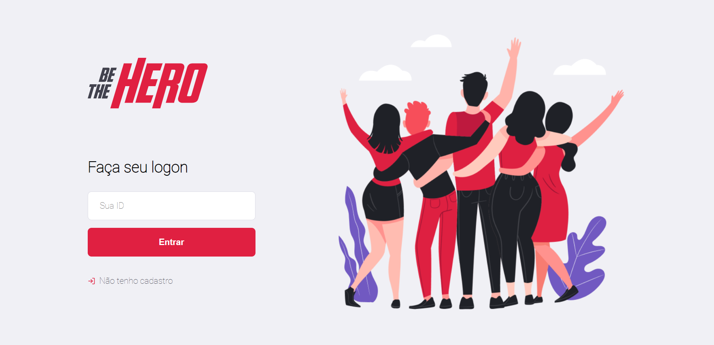
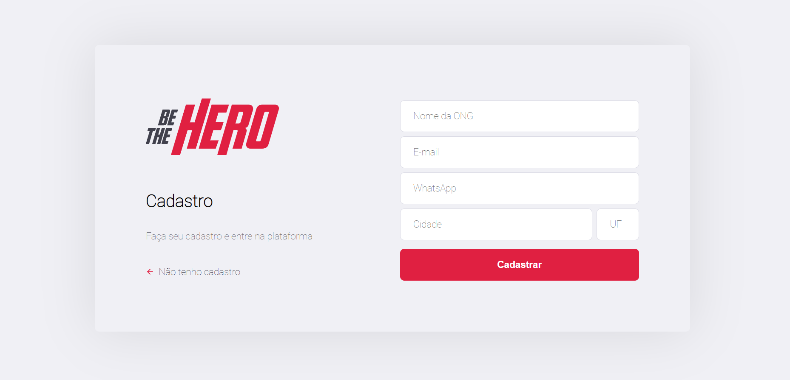
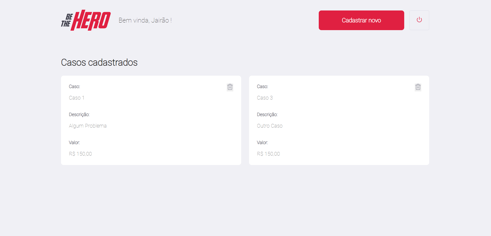
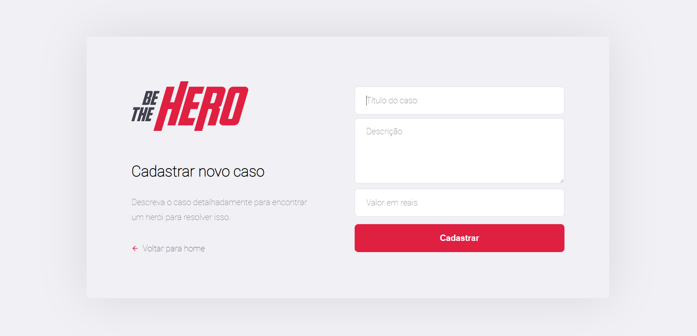

# Be the hero :blue_heart:
 
- Projeto criado pela Rocketseat para ensinar devs a stack JavaScript :collision: 

# Libs/Dependências :books:

 - Frontend :purple_heart:

    - axios :heavy_check_mark:

 - Backend :yellow_heart:

    - express :heavy_check_mark:
    - cors :heavy_check_mark:
    - celebrate :heavy_check_mark:
    - knex :heavy_check_mark:

# Interface

  ## Login

   

   - Versão final :heavy_check_mark:

  ## Cadastro 
   
   

   - Versão final :heavy_check_mark:

  ## Página Inicial

   

   - Versão final :heavy_check_mark:

  ## Novo Caso 

   

   - Versão final :heavy_check_mark:
